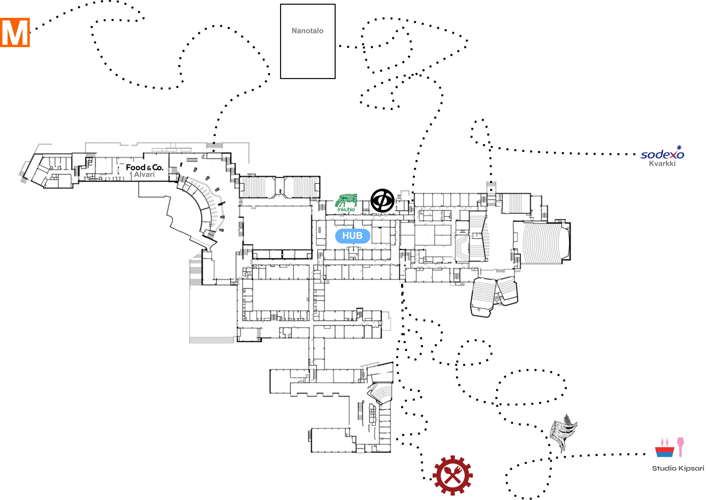

# MATLAB Text Adventure Game - MTAG [A! edition]



## What?

This is a 'point and click' style text adventure game made with `MATLAB`. The idea was born during making video analysis scripts that used the `ginput()` function and then it went forward from there. The venue of the game is the undergraduate center of Aalto University and the game encapsulates some of the iconic things in Aalto, but __it is not and by no means tries to be__ a complete desciption of the student culture of Aalto. So, take it just as a cartoon etc.

The coding was made in a way that the logic of the code couldn't be immediately seen (reason for using `eval()` in some places), which is not maybe optimal for the code readability in development sense.

## How to play?

The game is started simply by running the script `run_me.m`, so if you're in the root directory, just type `run_me` to the command window. Then the game will go forward in itself. __Note:__ Do not close figure widows yourself, that will cause a crash.

## Notes for further development

Do you want to take the game further? Awesome! Adding places to the game map is fairly simple: It is done by editing script `generate_places.m`. There you simple specify the bounding box x- and y-coordinates for the place (the click box), the name and description of the place and the _action_ for the place. This is done for example as follows:

```
places(2).name = 'Lecture hall U2';
places(2).location.x = [4140, 4600, 4600, 4140];
places(2).location.y = [1785, 1785, 2130, 2130];
places(2).description = places(1).description;
places(2).action = 'lecture_function(400)';
```

Then you have to run the `generate_places.m` script to save the modifications to the `places.mat` file that is used by the game. In addition, if you want your new place to have an illustration on the map, you should edit the image `./MTAG/Figs/map_with_features.png` accordingly. Keep the image size constant unless you want to fix the location of all the click boxes.

The _action_ for the given place is the name of the function that will be called when the player enters the place. In the above example, the action function is `lecture_function()` with parameter 400 (refers to the number os students on the lecture). The action function should always return 4 values: `[dm, de, di, eline]` These are the change in money, energy and intelligence after visiting the place, respectively. In addition, the value `eline` is a string that is directly fed to `eval()` and thus is allows you to have special effects or change the main loop varibales. But note that as it's evaluated without a filter, it can also create conflicts or you can for example have `eline = 'break'`, which will break the main loop immediately...